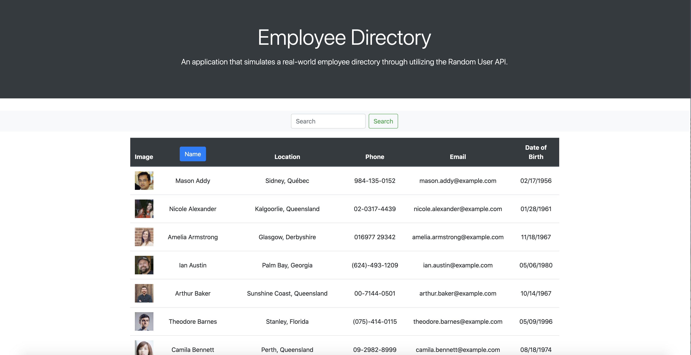
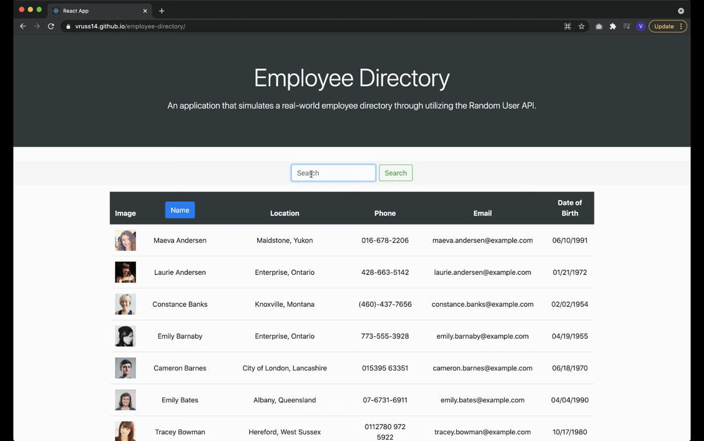

# Employee Directory

A CMS solution that allows users to view a list of pseudo-employees, search by name, and sort by last name.

## Description

This website utilizes React to dynamically display pseudo-employee data. Users can view 100 "employees" from the Random User API, which can then be searched and sorted. As users input a query into the search bar at the top of the page, the pseudo-employee list changes to display only the pseudo-employees who match the search criteria. Deleting all text in the search bar results in the original list being displayed. By clicking the "Name" button in the table header, users can sort pseudo-employees by last name (A–Z and Z–A, with A–Z as the default).

This website was very challenging for me to create, and I learned a lot in the process. One of the most difficult parts was understanding how to ensure everything was connected (i.e. all components received all necessary props to function correctly). React certainly has a bit of a learning curve, but I was eventually able to better understand how each file of JavaScript code relates to the others.

I used a lot of array methods in this website, including .map(), .filter(), and even .flat(). I had never heard of using .flat() before, but through my research I realized that it was an excellent solution in making sure that there are no nested arrays (and thus, inaccessible properties) when displaying the list of pseudo-employees.

An additional challenge for me was debugging errors in which the code failed to compile on my local computer. I tend to use console.log within JavaScript files to get a better idea of why unexpected behavior is happening, but if nothing compiled, I didn't have that ability. It was a great challenge in thinking logically and using my JavaScript knowledge base.

A few ideas for future development include:

- Adding additional sorting functionality
- Adding additional search functionality
- Adding more CSS/custom styling to the page

## Technologies Used

- HTML5
- CSS3
- JavaScript
- React JS and JSX
- Moment.js

## Table of Contents

- [Installation](#Installation)
- [Usage](#Usage)
- [License](#License)
- [Contributing](#Contributing)
- [Tests](#Tests)
- [Questions](#Questions)
            
## Installation

The application can be viewed live on GitHub Pages here: https://vruss14.github.io/employee-directory/

Alternatively, the application can be cloned and run locally at port 3000. Navigate to the correct directory and run ```npm start``` in the command line to do so.

A view of the home page:



A view of the website's functionality:



## Usage

This application is only intended to view, sort, and filter a list of pseudo-employees.

## License

This project has not yet been licensed, and thus, standard copyright laws apply.
            
## Contributing

Valerie Russell is the sole contributor to this project. 
            
## Tests

There are currently no tests written for this project.
            
## Questions

If you have any questions about this application my GitHub username is vruss14 and you can view my GitHub profile at https://github.com/vruss14.

If you have additional questions, feel free to reach out to me at vruss14@gmail.com.
